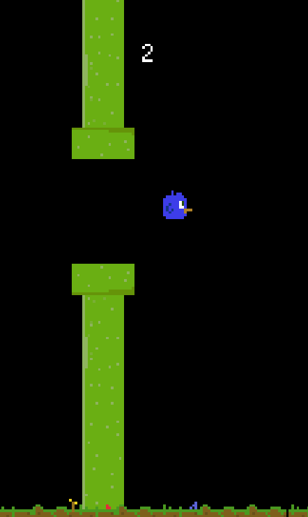

# Flappy Space Bird Remake

## Description

This is a Java remake of the classic game "Flappy Bird". In this version, the bird is navigating through space, avoiding obstacles and trying to stay airborne. The controls are simple: press the spacebar to make the bird jump.

## Features

- **Simple Controls**: Press the spacebar to make the bird jump.
- **Obstacle Avoidance**: Dodge obstacles to keep the bird flying.
- **Scorekeeping**: Track your progress and try to beat your high score.

## Screenshots



## Installation

1. Clone or download the repository.
2. Ensure you have Java installed on your system.
3. Compile and run the `Game.java` file.

```bash
javac Game.java
java Game
```

## Controls

- **Spacebar**: Jump

## Gameplay Instructions

- Press the spacebar to make the bird jump.
- Navigate through the canes obstacles to earn points.
- Try to beat your high score!

## Sprites

All sprites in this game were designed by me specifically for this project.

## Future Enhancements

- Sound effects and background music.
- Additional levels or difficulty settings.
